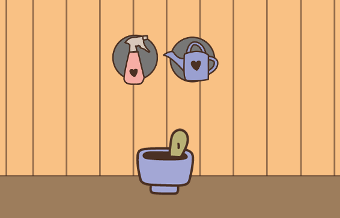

# 🌱 Sprout – Cozy Game en Point-and-Click  
**Sprout** est un jeu vidéo **cozy** en point-and-click où les joueurs prennent soin de petites plantes. Le gameplay est centré sur l’entretien de plantes : arrosage, taille, retrait des feuilles mortes et création de boutures rares à collectionner ou échanger.

Construit en **7 jours**, ce projet est une plongée dans l’univers des **cozy games**, avec une ambiance chill et un gameplay relaxant.

## 🎮 Fonctionnalités  
- **Arrosage des plantes** : Maintenez vos plantes en bonne santé.  
- **Déparasitage** : Retirez les parasites pour garder les plantess en pleine forme.

## 🛠️ Technologies utilisées  
- **Langage** : C#  
- **Moteur de jeu** : [Godot Engine](https://godotengine.org)  
- **Type de jeu** : Point-and-click, Cozy Game  

## 📊 Quelques stats  
- **Nombre de lignes de code** : 208 (* 2)
- **Temps de développement** : 7 jours  

## 📷 Screenshots  


## 🚀 Installation  
1. Clonez le dépôt :  
   ```bash
   git clone https://github.com/DubertJulie/sprout.git
   ```  
2. Ouvrez le projet avec **Godot Engine**.  
3. Lancez le jeu en cliquant sur Play.  

## 💡 Idées futures  
- Ajout de nouvelles variétés de plantes.  
- Taille et bouturage.
- MMonnaie et échange de plantes.

## 💬 Remerciements  
Merci à l’équipe pédagogique de **Simplon Hauts-de-France** et à mes collègues pour leur soutien pendant ce projet.  
